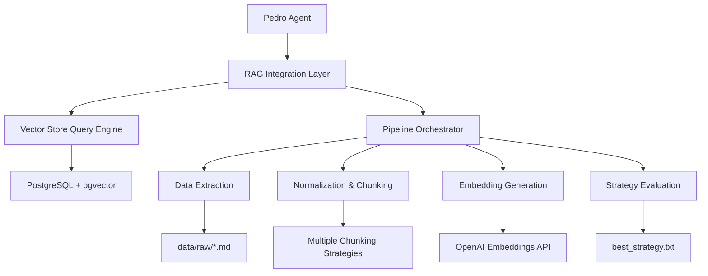
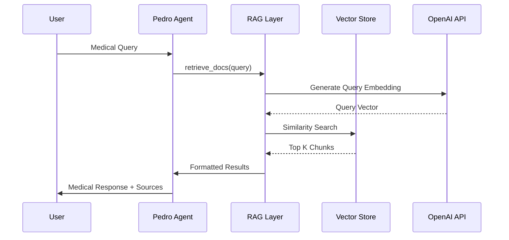

# Design Document

## Overview

Este documento descreve o design para integrar completamente o agente Pedro com o pipeline RAG, substituindo o sistema de busca simples atual por um sistema baseado em embeddings vetoriais com estratégias otimizadas de chunking.

## Architecture

### High-Level Architecture



### Component Interaction Flow



## Components and Interfaces

### 1. RAG Integration Layer

**Purpose**: Abstração entre Pedro e o pipeline RAG completo

**Interface**:
```python
class RAGIntegration:
    def retrieve_docs_with_embeddings(self, query: str, limit: int = 3) -> str
    def get_best_strategy(self) -> str
    def ensure_pipeline_ready(self) -> bool
    def get_rag_stats(self) -> Dict[str, Any]
```

**Key Methods**:
- `retrieve_docs_with_embeddings()`: Busca baseada em similaridade vetorial
- `get_best_strategy()`: Retorna estratégia otimizada do arquivo best_strategy.txt
- `ensure_pipeline_ready()`: Verifica se vector_store está populada
- `get_rag_stats()`: Métricas de performance do RAG

### 2. Vector Store Query Engine

**Purpose**: Interface otimizada para consultas na vector_store

**Interface**:
```python
class VectorStoreEngine:
    def similarity_search(self, query_embedding: List[float], limit: int, strategy: str = None) -> List[Dict]
    def generate_query_embedding(self, query: str) -> List[float]
    def get_chunk_context(self, chunk_id: int) -> Dict[str, Any]
    def get_source_metadata(self, source: str) -> Dict[str, Any]
```

**Key Features**:
- Busca por similaridade coseno usando pgvector
- Cache de embeddings para queries frequentes
- Filtros por estratégia de chunking
- Metadados enriquecidos dos chunks

### 3. Pipeline Orchestrator

**Purpose**: Gerencia execução automática do pipeline RAG

**Interface**:
```python
class PipelineOrchestrator:
    def check_pipeline_status(self) -> Dict[str, Any]
    def run_pipeline_if_needed(self) -> bool
    def monitor_data_changes(self) -> None
    def get_pipeline_metrics(self) -> Dict[str, Any]
```

**Key Features**:
- Detecção automática de novos arquivos em data/raw/
- Execução incremental do pipeline
- Monitoramento de saúde do sistema
- Alertas para falhas críticas

### 4. Configuration Manager

**Purpose**: Gerencia configurações e variáveis de ambiente

**Interface**:
```python
class ConfigManager:
    def load_env_file(self, env_file: str = ".env.test") -> bool
    def validate_required_settings(self) -> List[str]
    def get_database_connection(self) -> Connection
    def get_openai_client(self) -> OpenAI
```

**Key Features**:
- Carregamento automático de .env.test
- Validação de configurações obrigatórias
- Fallbacks para configurações opcionais
- Diagnósticos de configuração

## Data Models

### Vector Store Schema

```sql
CREATE TABLE vector_store (
    id SERIAL PRIMARY KEY,
    chunk_id INTEGER REFERENCES stage_chunks(id),
    embedding VECTOR(1536),
    content TEXT NOT NULL,
    source VARCHAR(255) NOT NULL,
    metadata JSONB,
    created_at TIMESTAMP DEFAULT NOW(),
    updated_at TIMESTAMP DEFAULT NOW()
);

CREATE INDEX idx_vector_store_embedding ON vector_store 
USING ivfflat (embedding vector_cosine_ops);
```

### Enhanced Chunk Metadata

```json
{
    "chunk_index": 0,
    "chunk_size": 512,
    "chunking_strategy": "SEM_1000",
    "embedding_model": "text-embedding-3-small",
    "source_metadata": {
        "file_name": "vademecum_pediatrico.md",
        "file_size": 45678,
        "last_modified": "2024-01-15T10:30:00Z"
    },
    "medical_context": {
        "category": "dosagem",
        "medication": "paracetamol",
        "age_group": "pediatrico"
    }
}
```

## Error Handling

### Error Categories

1. **Configuration Errors**
   - Missing environment variables
   - Invalid database connection
   - OpenAI API key issues

2. **Pipeline Errors**
   - Data extraction failures
   - Embedding generation timeouts
   - Vector store corruption

3. **Query Errors**
   - Empty vector store
   - Malformed queries
   - API rate limits

### Error Recovery Strategies

```python
class ErrorHandler:
    def handle_config_error(self, error: ConfigError) -> bool:
        # Provide clear diagnostic messages
        # Suggest specific fixes
        # Attempt auto-recovery where possible
    
    def handle_pipeline_error(self, error: PipelineError) -> bool:
        # Log detailed error context
        # Attempt partial recovery
        # Notify administrators
    
    def handle_query_error(self, error: QueryError) -> str:
        # Return user-friendly error message
        # Suggest alternative queries
        # Fallback to simple search if needed
```

## Testing Strategy

### Unit Tests

1. **RAG Integration Layer**
   - Mock OpenAI API responses
   - Test embedding generation
   - Validate query formatting

2. **Vector Store Engine**
   - Test similarity search accuracy
   - Validate metadata handling
   - Performance benchmarks

3. **Pipeline Orchestrator**
   - Mock file system changes
   - Test incremental updates
   - Validate error handling

### Integration Tests

1. **End-to-End RAG Flow**
   - Complete pipeline execution
   - Pedro query processing
   - Response quality validation

2. **Database Integration**
   - Vector store operations
   - Transaction handling
   - Connection pooling

### Performance Tests

1. **Query Response Time**
   - Target: < 5 seconds per query
   - Concurrent user simulation
   - Memory usage monitoring

2. **Pipeline Execution**
   - Large document processing
   - Embedding generation throughput
   - Database write performance

## Security Considerations

### Data Protection

1. **Sensitive Information**
   - Medical data encryption at rest
   - Secure API key storage
   - Access logging

2. **Query Sanitization**
   - Input validation
   - SQL injection prevention
   - Rate limiting

### Access Control

1. **Database Security**
   - Row-level security policies
   - Connection encryption
   - Audit logging

2. **API Security**
   - Authentication tokens
   - Request signing
   - CORS configuration

## Performance Optimization

### Caching Strategy

1. **Query Embedding Cache**
   - Redis for frequent queries
   - TTL-based invalidation
   - Memory usage limits

2. **Result Caching**
   - Cached formatted responses
   - Context-aware invalidation
   - Compression for large results

### Database Optimization

1. **Vector Indexing**
   - IVFFlat index for embeddings
   - Optimal index parameters
   - Regular index maintenance

2. **Query Optimization**
   - Prepared statements
   - Connection pooling
   - Query plan analysis

## Deployment Strategy

### Environment Configuration

1. **Development**
   - Local PostgreSQL with pgvector
   - File-based configuration
   - Debug logging enabled

2. **Production**
   - Supabase with vector support
   - Environment-based config
   - Structured logging

### Monitoring and Alerting

1. **Health Checks**
   - Vector store connectivity
   - OpenAI API availability
   - Pipeline execution status

2. **Performance Metrics**
   - Query response times
   - Embedding generation rates
   - Error rates and types

## Migration Plan

### Phase 1: Infrastructure Setup
1. Configure environment variables
2. Initialize vector store
3. Execute initial pipeline run

### Phase 2: Pedro Integration
1. Replace simple search with vector search
2. Implement error handling
3. Add performance monitoring

### Phase 3: Optimization
1. Fine-tune chunking strategies
2. Implement caching
3. Performance optimization

### Phase 4: Production Deployment
1. Supabase migration
2. Automated pipeline scheduling
3. Monitoring and alerting setup