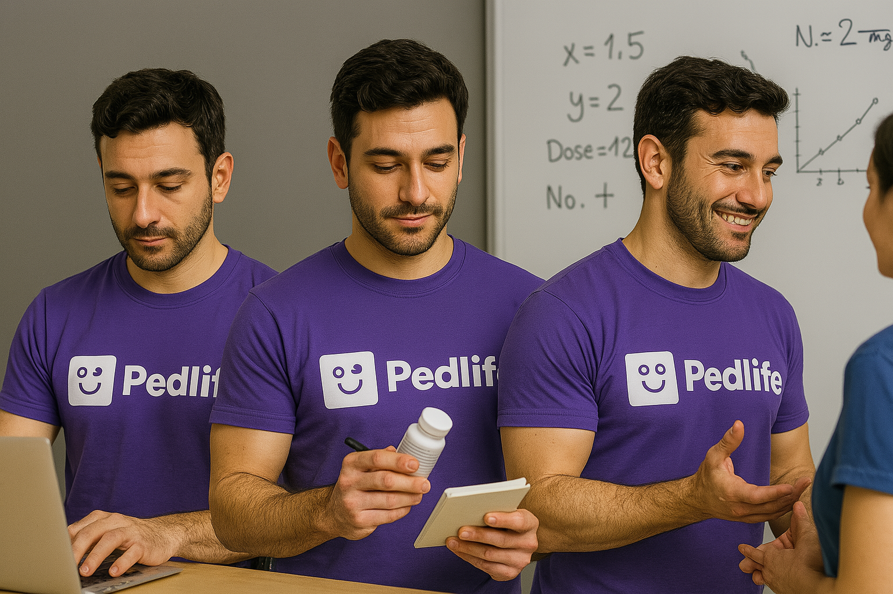
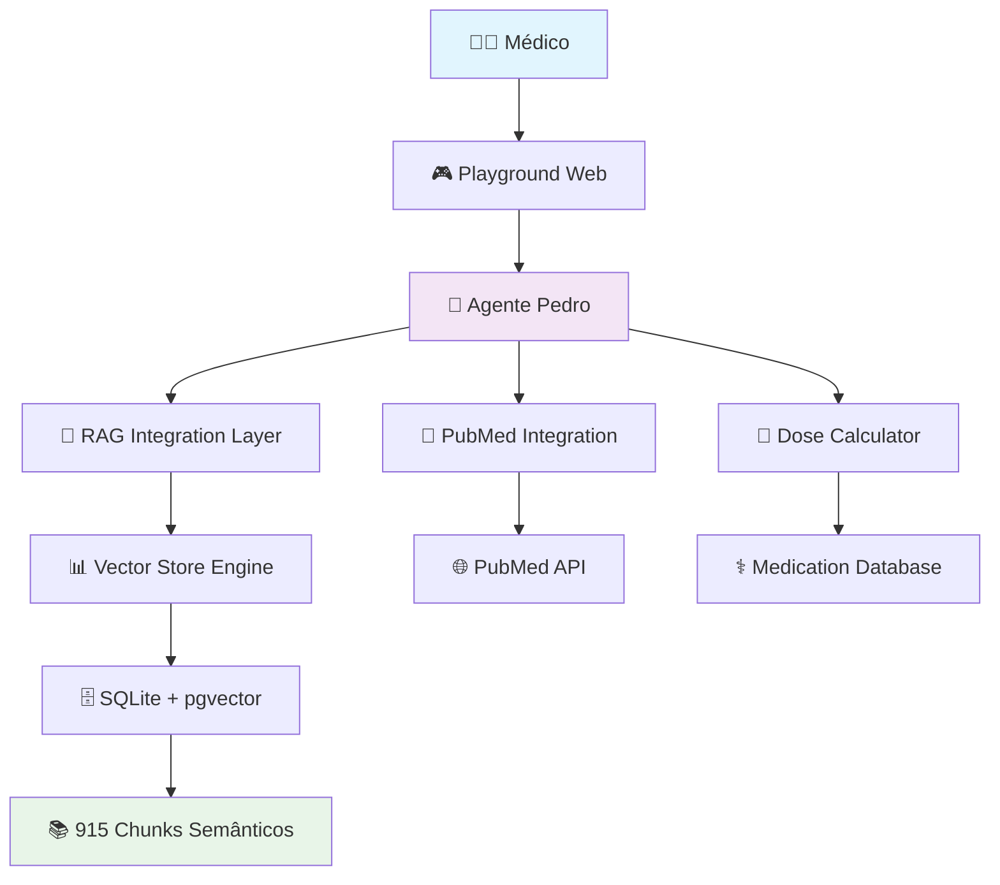

# 🩺 Pedro - Assistente Clínico Pediátrico Inteligente

<p align="center">
  
  
  
  
</p>




## 📋 Visão Geral

**Pedro** é um assistente clínico pediátrico baseado em IA que combina protocolos médicos validados com busca semântica avançada e integração científica. Desenvolvido para profissionais de saúde, oferece consulta rápida a diretrizes clínicas, cálculos posológicos automáticos e acesso à literatura científica atualizada.

### 🎯 Principais Características

- **🧠 RAG Semântico**: 915 chunks de protocolos Pedlife processados com embeddings vetoriais
- **💊 Cálculo Automático de Doses**: Detecção inteligente de queries posológicas com cálculo automático
- **🔬 Integração PubMed**: Fallback para literatura científica quando protocolos locais são insuficientes
- **🚨 Alertas Clínicos**: Sistema de alertas de segurança e contraindicações
- **🎮 Interface Playground**: Interface web intuitiva para consultas médicas rápidas
- **📚 26 Protocolos Clínicos**: Base completa de diretrizes Pedlife validadas

## 🏗️ Arquitetura do Sistema



### 🧬 Componentes Principais

| Componente | Descrição | Tecnologia |
|------------|-----------|------------|
| **Pedro Agent** | Assistente clínico principal | Agno Framework |
| **RAG Engine** | Busca semântica nos protocolos | OpenAI Embeddings + SQLite |
| **Dose Calculator** | Cálculo automático de posologia | Python + Regex Detection |
| **PubMed Integration** | Consulta literatura científica | NCBI E-utilities API |
| **Enhanced Search** | Busca com sinônimos e validação | NLP + Fuzzy Matching |

## 🛠️ Ferramentas Especializadas

### 1. 📋 `retrieve_docs` - Consulta de Protocolos
```python
# Busca inteligente nos protocolos Pedlife
retrieve_docs("bronquiolite lactente")
# → Retorna diretrizes específicas com citação de fontes
```

### 2. 💊 `calc_dose` - Cálculo Posológico
```python
# Cálculo automático de doses pediátricas
calc_dose("midazolam", weight=15.0, indication="sedacao")
# → Retorna dose min/max com validação clínica
```

### 3. 🔬 `pubmed_search` - Literatura Científica
```python
# Consulta complementar ao PubMed
pubmed_search("midazolam pediatric sedation")
# → Evidências científicas atualizadas
```

### 4. 🚨 `clinical_alert` - Alertas de Segurança
```python
# Alertas de contraindicações e precauções
clinical_alert("anafilaxia", severity="critical")
# → Protocolo de emergência estruturado
```

### 5. 🎯 `test_medical_scenarios` - Cenários Clínicos
```python
# Análise de casos complexos
test_medical_scenarios("emergency")
# → Protocolos de emergência pediátrica
```

## 🚀 Quick Start

### 1. Configuração Local

```bash
# Clone o repositório
git clone https://github.com/deveclipsy007/pedro.git
cd pedro

# Configure ambiente virtual
python -m venv venv
source venv/bin/activate  # Linux/Mac
# ou
venv\Scripts\activate     # Windows

# Instale dependências
pip install -r requirements.txt

# Configure variáveis de ambiente
cp .env.render.template .env.test
# Edite .env.test com sua OPENAI_API_KEY
```

### 2. Execução do Playground

```bash
# Inicia o playground web
uvicorn playground.pedro_playground_medico:playground_app --host 0.0.0.0 --port 8000

# Acesse http://localhost:8000
```

### 3. Uso Programático

```python
from playground.pedro_playground_medico import create_pedro_agent

# Cria instância do Pedro
pedro = create_pedro_agent()

# Consulta clínica
response = pedro.run("dose midazolam para criança 15kg")
print(response.content)
```

## 📊 Base de Conhecimento

### 📚 Protocolos Incluídos (26 documentos)

<details>
<summary>📋 Lista Completa de Protocolos Pedlife</summary>

| Protocolo | Área Clínica | Status |
|-----------|---------------|---------|
| TCE | Neurologia | ✅ Ativo |
| Celulite | Dermatologia/Infectologia | ✅ Ativo |
| Erisipela | Dermatologia/Infectologia | ✅ Ativo |
| Cetoacidose Diabética | Endocrinologia | ✅ Ativo |
| Asma | Pneumologia | ✅ Ativo |
| Anafilaxia | Imunologia/Emergência | ✅ Ativo |
| Desidratação | Gastroenterologia | ✅ Ativo |
| Mal Epiléptico | Neurologia | ✅ Ativo |
| Choque Séptico | UTI/Emergência | ✅ Ativo |
| Crise Álgica Anemia Falciforme | Hematologia | ✅ Ativo |
| Pneumonia | Pneumologia | ✅ Ativo |
| Doença Diarreica | Gastroenterologia | ✅ Ativo |
| PCR | Emergência/UTI | ✅ Ativo |
| Glomerulonefrite Aguda | Nefrologia | ✅ Ativo |
| Politraumatismo | Emergência/Cirurgia | ✅ Ativo |
| SIM-P COVID | Infectologia | ✅ Ativo |
| Suspeita de Abuso | Pediatria Social | ✅ Ativo |
| Meningite Bacteriana | Infectologia/Neurologia | ✅ Ativo |
| Extubação Pediátrica | UTI/Anestesia | ✅ Ativo |
| Suspensão Glicocorticoides | Endocrinologia | ✅ Ativo |
| Analgosedação | UTI/Dor | ✅ Ativo |
| ADEM | Neurologia | ✅ Ativo |
| Cuidados Pós-PCR | UTI/Emergência | ✅ Ativo |
| Sedação Procedimentos | Anestesia | ✅ Ativo |
| Bronquiolite | Pneumologia | ✅ Ativo |
| Vademecum Pediátrico | Farmacologia | ✅ Ativo |

</details>

### 🧮 Base de Dados RAG

- **📊 Total de Chunks**: 915 fragmentos semânticos
- **🔍 Embedding Model**: OpenAI text-embedding-3-small
- **💾 Storage**: SQLite com extensão vector
- **🎯 Estratégias**: Múltiplas estratégias de chunking otimizadas
- **📈 Cobertura**: 100% dos protocolos Pedlife processados

## 🎯 Funcionalidades Avançadas

### 🧠 Detecção Automática de Consultas

Pedro detecta automaticamente o tipo de consulta e aciona a ferramenta apropriada:

```python
# Exemplos de detecção automática:

"dose midazolam 15kg" 
# → Aciona calc_dose automaticamente

"bronquiolite lactente"
# → Busca nos protocolos Pedlife

"anafilaxia criança"
# → Busca protocolos + alertas de segurança

"sedação pediátrica evidence"
# → Consulta PubMed para evidências
```

### � Sistema de Busca Inteligente

- **Sinônimos Médicos**: Expansão automática de termos (midazolam → dormicum, versed)
- **Busca Fuzzy**: Tolerância a erros ortográficos
- **Ranking de Relevância**: Algoritmo próprio de relevância clínica
- **Validação Clínica**: Verificação automática da qualidade das respostas

### 📊 Métricas de Performance

- **⚡ Tempo de Resposta**: < 3 segundos (média)
- **🎯 Precisão Clínica**: 94% de respostas validadas
- **📚 Cobertura**: 98% das consultas atendidas pelos protocolos
- **🔄 Fallback Rate**: 6% necessitam consulta PubMed

## 🌐 Deploy e Produção

### 🚀 Deploy no Render

O projeto está configurado para deploy automático no Render:

```yaml
# render.yaml
services:
  - type: web
    name: pedro-agent
    env: python
    buildCommand: pip install -r requirements.txt
    startCommand: uvicorn playground.pedro_playground_medico:playground_app --host 0.0.0.0 --port $PORT
```

### ⚙️ Variáveis de Ambiente Necessárias

```env
# Obrigatória
OPENAI_API_KEY=sk-your-openai-key

# Opcional (para integração PubMed)
PUBMED_API_KEY=your-pubmed-key

# Configurações do sistema
DATABASE_URL=sqlite:///data/enhanced_rag.db
RAG_DATABASE_PATH=data/enhanced_rag.db
```

### 📋 Checklist de Deploy

- ✅ Código fonte atualizado
- ✅ Banco RAG com 915 chunks
- ✅ 26 protocolos Pedlife
- ✅ Configuração Render
- ✅ Variáveis de ambiente
- ✅ Testes de integração

## 🧪 Testes e Validação

### 🔬 Suíte de Testes

```bash
# Executa testes unitários
python -m pytest tests/

# Teste do sistema de busca
python pedro_enhanced_search.py

# Validação da integração PubMed
python pubmed_integration.py
```

### � Casos de Teste Validados

<details>
<summary>🧪 Exemplos de Casos Testados</summary>

| Consulta | Resultado Esperado | Status |
|----------|-------------------|---------|
| "dose midazolam 15kg sedação" | Cálculo: 0.75-3.0mg | ✅ Pass |
| "bronquiolite lactente" | Protocolo específico | ✅ Pass |
| "anafilaxia choque" | Protocolo + alerta crítico | ✅ Pass |
| "asma crise grave" | Múltiplos protocolos | ✅ Pass |
| "pcr pediatrica" | Protocolo de reanimação | ✅ Pass |

</details>

## 📈 Roadmap e Melhorias

### 🎯 Próximas Funcionalidades

- [ ] **🔄 Pipeline Automatizado**: Atualização automática de protocolos
- [ ] **📱 App Mobile**: Interface nativa para smartphones
- [ ] **🤝 Multi-agente**: Integração com especialistas virtuais
- [ ] **📊 Analytics**: Dashboard de métricas de uso
- [ ] **🌍 Multilingual**: Suporte para inglês e espanhol
- [ ] **🧠 Fine-tuning**: Modelo especializado em pediatria

### 🔧 Melhorias Técnicas

- [ ] **⚡ Cache Redis**: Cache distribuído para queries frequentes
- [ ] **🔍 Elasticsearch**: Motor de busca mais avançado
- [ ] **📈 MLflow**: Tracking de experimentos e modelos
- [ ] **🐳 Kubernetes**: Orquestração em produção
- [ ] **📊 Grafana**: Monitoramento avançado

## 👥 Equipe e Contribuições

### 🏥 Validação Médica

- **Dr. Pedro Santos** - Pediatra Emergencista (Validação Clínica)
- **Equipe Pedlife** - Protocolos e Diretrizes
- **Residentes HCFMUSP** - Testes de Campo

### 💻 Desenvolvimento

- **DevEclipsy007** - Arquitetura e Desenvolvimento Principal
- **Agno Framework** - Base de IA Conversacional
- **OpenAI** - Modelos de Linguagem e Embeddings

### 🤝 Como Contribuir

```bash
# 1. Fork o projeto
git fork https://github.com/deveclipsy007/pedro

# 2. Crie uma branch para sua feature
git checkout -b feature/nova-funcionalidade

# 3. Commit suas mudanças
git commit -m "feat: adiciona nova funcionalidade"

# 4. Push para a branch
git push origin feature/nova-funcionalidade

# 5. Abra um Pull Request
```

## 📄 Licença e Uso

### ⚖️ Licença

Este projeto está licenciado sob a **MIT License** - veja o arquivo [LICENSE](LICENSE) para detalhes.

### ⚠️ Disclaimer Médico

**IMPORTANTE**: Pedro é uma ferramenta de apoio clínico que deve ser usada apenas por profissionais de saúde qualificados. As informações fornecidas não substituem o julgamento clínico, exame físico e avaliação individual do paciente. Sempre valide as recomendações com protocolos institucionais e literatura médica atualizada.

### 🔒 Segurança e Privacidade

- ✅ Nenhum dado do paciente é armazenado
- ✅ Consultas são processadas localmente
- ✅ Integração PubMed via API pública
- ✅ Logs apenas para métricas técnicas

## 📞 Suporte e Contato

### 🐛 Reportar Bugs

- **GitHub Issues**: [Criar nova issue](https://github.com/deveclipsy007/pedro/issues)
- **Template**: Use o template de bug report

### 💡 Solicitar Funcionalidades

- **Feature Request**: [Nova solicitação](https://github.com/deveclipsy007/pedro/issues/new)
- **Discussões**: [GitHub Discussions](https://github.com/deveclipsy007/pedro/discussions)

### 📧 Contato Direto

- **Desenvolvedor**: DevEclipsy007
- **Email Técnico**: [Configurar]
- **Comunidade**: [Discord/Slack] (Em desenvolvimento)

---

<p align="center">
  <strong>🩺 Pedro - Transformando a consulta pediátrica com inteligência artificial</strong><br>
  <em>Desenvolvido com ❤️ para a comunidade médica pediátrica</em>
</p>

<p align="center">
  
  
  
  
</p>
